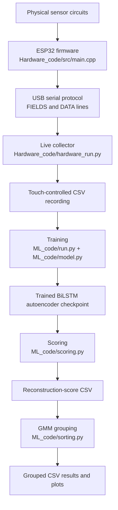

# Wearable Wellness Monitoring and Anomaly-Detection System

## Project Overview

This project is a wearable wellness-monitoring prototype that combines physical sensor circuits, ESP32 firmware, live serial data collection, CSV dataset generation, and a machine-learning analysis pipeline.

The system is designed to:

1. read wearable sensor signals from an ESP32;
2. transmit machine-readable serial messages to a Mac;
3. save selected live readings to CSV using capacitive-touch start/stop control;
4. train a bidirectional LSTM autoencoder on chronological sensor windows;
5. score reconstructed windows using mean squared reconstruction error;
6. group reconstruction scores with a Gaussian Mixture Model.

The reconstruction scores and score groups are numerical engineering outputs. They are not medical diagnoses and do not prove fatigue, illness, danger, or health status.

## Motivation

Wearable sensors can collect useful time-series data about motion, touch, skin-adjacent temperature circuitry, pulse-sensor analog behavior, and other physical signals. This project explores how those signals can be collected into a clean dataset and analyzed with an autoencoder model.

The goal is not to diagnose a person. The goal is to build and document an experimental end-to-end engineering system: sensor hardware, embedded firmware, data collection, model training, reconstruction scoring, and unsupervised score grouping.

## Complete Project Workflow

```text
Physical sensor circuits
    ↓
ESP32 firmware in Hardware_code/src/main.cpp
    ↓
USB serial FIELDS and DATA messages
    ↓
Hardware_code/hardware_run.py
    ↓
capacitive-touch-controlled CSV recording
    ↓
ML_code/run.py and ML_code/model.py
    ↓
trained BiLSTM autoencoder
    ↓
ML_code/scoring.py
    ↓
reconstruction-score CSV
    ↓
ML_code/sorting.py
    ↓
GMM groups and membership probabilities
```



`Hardware_code/src/main.cpp` runs continuously on the ESP32. `Hardware_code/hardware_run.py` runs simultaneously on the Mac and reads each serial sample shortly after the ESP32 sends it. The Python script does not wait for the firmware to finish, because the firmware normally continues running until power is removed, the ESP32 is reset, or different firmware is uploaded.

## Hardware Components

The current repository confirms the following hardware interfaces through the firmware source. Some physical construction details, such as exact mounting materials and signal-conditioning component values, are not documented in repository files yet.

| Component | Purpose | Interface | Current status |
| --- | --- | --- | --- |
| ESP32 ESP-WROOM-32 development board | Main microcontroller for reading sensors and sending serial data | USB serial, ADC, GPIO, I2C | Required by `platformio.ini` board target `esp32dev` |
| LM358-buffered thermistor circuit | Produces analog thermistor-related voltage | ESP32 GPIO35 analog input | Referenced by firmware comments and pin constant |
| Pulse sensor | Produces analog pulse-sensor signal | ESP32 GPIO34 analog input | Referenced by firmware comments and pin constant |
| Homemade foil capacitive sensor | Touch start/stop control for CSV recording | GPIO25 through 1 MΩ resistor to GPIO27 and foil pad | Confirmed by firmware comments and measurement function |
| 1 MΩ capacitive-sensor resistor | Forms capacitive charge timing circuit | Between GPIO25 and GPIO27/foil node | Confirmed by firmware comments |
| MPU-6050 or GY-521 module | Motion sensing through accelerometer and gyroscope raw values | I2C address `0x68` | Confirmed by firmware address and MPU6050 library |
| Solderable protoboard | Physical mounting/interconnection board | Soldered nodes | Not verified by repository files |
| Thin stranded wire | Flexible sensor interconnects | Physical wiring | Not verified by repository files |
| Resistors/capacitors for signal conditioning | Filtering/dividers/biasing depending on circuit | Analog circuit elements | Exact values not verified except capacitive 1 MΩ resistor |
| Velcro, foam, insulation, or rigid base | Wearable mounting and protection | Mechanical construction | Planned/possible, not verified by repository files |

## Hardware Design and Physical Construction

This section describes the intended physical build and the construction considerations for the current prototype. The repository currently contains firmware and software, but it does not contain a BOM, PCB design, circuit notes, photos, or safety checklist. Any construction detail not backed by the code is described as intended or requiring verification.

The system should be developed in stages. Individual sensors should first be tested one at a time so their signal ranges and wiring are understood. After each circuit works independently, the circuits can be moved to a solderable protoboard and connected to the ESP32 using common power and common ground rails.

On a protoboard, solder, component leads, and short wires form electrical nodes. Adjacent pads should be inspected carefully to avoid unintended solder bridges. Exposed conductors should be insulated so they cannot short against skin, straps, foil, neighboring wires, or the ESP32. Flexible stranded wire is preferred for wearable movement because repeated bending can break solid-core wire more easily. Wires should receive strain relief near the board and near sensor locations so motion does not pull directly on solder joints.

Sensor placement matters. The pulse sensor is sensitive to motion and ambient light. The capacitive foil baseline depends on wire length, placement, nearby conductive material, and how the wearer touches it. The MPU-6050 must be secured so it measures wearable motion rather than loose board vibration. The current prototype should be treated as a temporary engineering build, not a finished enclosure or PCB.

### Thermistor Circuit Construction

The firmware confirms an `LM358`-buffered thermistor analog output connected to ESP32 GPIO35. It also includes a wiring comment saying the LM358 thermistor output should be moved from GPIO23 to GPIO35.

The repository does not confirm the thermistor equation or exact circuit constants, such as:

- NTC nominal resistance;
- fixed divider resistor;
- parallel resistor;
- RC low-pass filter values;
- supply/reference voltage;
- beta coefficient or Steinhart-Hart coefficients;
- divider orientation.

Because those values are not verified in the project files, the firmware transmits only:

- `thermistor_adc_raw`
- `thermistor_millivolts`

It does not transmit `temperature_c`. This avoids fabricating temperature values from unconfirmed calibration constants.

The divider, filter, and buffer are normally used to convert resistance changes into a stable voltage, reduce noise, and isolate the sensor circuit from the ESP32 ADC input. The LM358 output entering GPIO35 must remain within the ESP32-safe analog input range. A 5 V output must not be applied directly to an ESP32 GPIO.

### Pulse-Sensor Construction

The firmware confirms the pulse-sensor analog signal is connected to GPIO34. It collects 100 pulse ADC samples with approximately 5 ms between readings, then reports:

- `pulse_average`
- `pulse_minimum`
- `pulse_maximum`
- `pulse_change`

The repository does not include a validated BPM algorithm, RC filter, amplifier description, or confirmed light-blocking material. The README therefore does not claim `heart_rate_bpm` is produced. For a physical wearable, the pulse sensor should be mounted firmly, motion should be reduced, and ambient-light interference should be controlled. Dark foam or another light-blocking material may be useful, but its use is not confirmed by the repository.

### Homemade Capacitive Sensor Construction

The capacitive sensor circuit is confirmed in the firmware:

```text
GPIO25 → 1 MΩ resistor → GPIO27 and foil pad
```

GPIO25 drives the charging cycle. GPIO27 observes the sensing node. The foil pad acts as the touch electrode. Touching the foil changes the effective capacitance, which changes how long the receive pin takes to read as charged. Wire length, nearby conductors, the wearable mounting position, and the user’s touch all affect the untouched baseline.

### MPU-6050 Mounting

The firmware uses an MPU-6050 at I2C address `0x68`. The module must be mechanically secured so its axis orientation remains consistent. If the module is loose, the readings may represent board vibration instead of body movement. Power, ground, SDA, and SCL wiring must match the actual firmware configuration.

The current firmware uses `Wire.begin()` with the Arduino-ESP32 default I2C pins. The repository does not contain an I2C scanner sketch confirming explicit SDA/SCL pins. The address `0x68` is an I2C device address, not an ESP32 GPIO pin.

### Wearable Mounting and Enclosure

The repository does not verify a completed enclosure. Suitable planned prototype features may include a forearm or wrist placement, Velcro strap, protoboard mounting, temporary rigid backing, insulated exposed leads, accessible foil pad, accessible USB connector, and light shielding around the pulse sensor. These should be treated as physical build goals unless confirmed in future hardware documentation.

## Wiring and Pin Connections

The wiring table below is based on `Hardware_code/src/main.cpp`.

| Hardware signal | ESP32 connection | Type |
| --- | ---: | --- |
| LM358/thermistor output | GPIO35 | Analog ADC input |
| Pulse-sensor signal | GPIO34 | Analog ADC input |
| Capacitive send | GPIO25 | Digital output |
| Capacitive receive and foil | GPIO27 | Digital input/output |
| MPU-6050 device address | `0x68` | I2C address |

MPU-6050 SDA/SCL configuration:

- The firmware calls `Wire.begin()`.
- No explicit SDA/SCL GPIO pins are set in the current source.
- `INFO,i2c_mode,default` is printed at startup.
- `0x68` is the MPU-6050 I2C address, not a physical ESP32 pin.

All sensor circuits must share a common ground with the ESP32. GPIO34 and GPIO35 are input-only pins in this design. Do not apply 5 V directly to any ESP32 GPIO. The LM358 output entering GPIO35 must stay within the ESP32-safe analog input range.

## Embedded Hardware Firmware: `Hardware_code/src/main.cpp`

`Hardware_code/src/main.cpp` is Arduino-framework firmware compiled by PlatformIO and uploaded to the ESP32. It continuously reads the hardware and sends strict serial messages to the Python collector.

The firmware responsibilities are:

- assign hardware pins;
- initialize serial communication at `115200`;
- configure 12-bit ADC readings;
- set ADC attenuation for GPIO34 and GPIO35 using `analogSetPinAttenuation(..., ADC_11db)`;
- initialize I2C using `Wire.begin()`;
- check for the MPU-6050 at address `0x68`;
- run `mpu.testConnection()`;
- read each physical sensor;
- summarize pulse and capacitive readings;
- format values into `INFO`, `ERROR`, `FIELDS`, and `DATA` lines;
- transmit samples continuously.

### Pin Constants

```cpp
const int THERMISTOR_PIN = 35;
const int PULSE_PIN = 34;
const int CAP_SEND_PIN = 25;
const int CAP_RECEIVE_PIN = 27;
const uint8_t MPU_ADDRESS = 0x68;
```

### Startup Messages

At startup, the firmware prints configuration/status lines such as:

```text
INFO,firmware_started
INFO,thermistor_pin,35
INFO,pulse_pin,34
INFO,capacitive_send_pin,25
INFO,capacitive_receive_pin,27
INFO,mpu_address,0x68
INFO,i2c_mode,default
INFO,mpu_detected,1
```

If the MPU-6050 is not detected or fails connection testing, the firmware prints:

```text
ERROR,mpu_not_detected_at_0x68
```

The firmware continues collecting thermistor, pulse, and capacitive values even if the MPU is unavailable.

### Serial Field Definition

The exact current `FIELDS` line is:

```text
FIELDS,timestamp_ms,thermistor_adc_raw,thermistor_millivolts,pulse_average,pulse_minimum,pulse_maximum,pulse_change,capacitive_average_us,capacitive_minimum_us,capacitive_maximum_us,mpu_connected,accel_x_raw,accel_y_raw,accel_z_raw,gyro_x_raw,gyro_y_raw,gyro_z_raw
```

The `DATA` row format is:

```text
DATA,<timestamp_ms>,<thermistor_adc_raw>,<thermistor_millivolts>,<pulse_average>,<pulse_minimum>,<pulse_maximum>,<pulse_change>,<capacitive_average_us>,<capacitive_minimum_us>,<capacitive_maximum_us>,<mpu_connected>,<accel_x_raw>,<accel_y_raw>,<accel_z_raw>,<gyro_x_raw>,<gyro_y_raw>,<gyro_z_raw>
```

Optional MPU measurement fields are left blank when the MPU is unavailable. The firmware does not fabricate MPU measurements.

### Sensor Handling

Thermistor:

- Reads GPIO35.
- Takes 16 samples.
- Rejects raw readings at the extremes (`0` and `4095`).
- Reports averaged ADC raw value and averaged millivolts.
- Does not calculate temperature because validated conversion constants are not present.

Pulse sensor:

- Reads GPIO34.
- Collects 100 samples.
- Waits about 5 ms between samples.
- Reports average, minimum, maximum, and change.
- Does not report BPM because no validated BPM algorithm exists in the current code.

Capacitive sensor:

- Uses GPIO25 as the send pin and GPIO27 as the receive/foil node.
- Measures charge time with a `30000` microsecond timeout.
- Takes 30 readings per output row.
- Reports average, minimum, and maximum microsecond charge times.

MPU-6050:

- Uses address `0x68`.
- Calls `mpu.getMotion6()` only when connected.
- Reports raw accelerometer and gyroscope values.
- Does not convert acceleration to g because the current firmware does not explicitly confirm the accelerometer range.

Because the pulse summary itself takes about 500 ms, the firmware sends one `DATA` line after each completed pulse-analysis block and does not add another large delay afterward.

## Live Data Collection: `Hardware_code/hardware_run.py`

`Hardware_code/hardware_run.py` is the live Python serial collector. It opens the ESP32 serial port, waits for the firmware `FIELDS` line, calibrates the capacitive sensor baseline, and saves valid `DATA` rows during a touch-controlled recording interval.

Supported command-line arguments include:

- `--port`
- `--baud`
- `--output`
- `--capacitive-field`
- `--touch-threshold`
- `--release-threshold`
- `--touch-direction`
- `--calibration-samples`
- `--debounce-ms`
- `--serial-timeout`
- `--reset-wait`
- `--status-interval`
- `--overwrite`
- `--list-ports`
- `--print-all-samples`

Important defaults:

| Option | Default |
| --- | --- |
| `--port` | `/dev/cu.usbserial-0001` |
| `--baud` | `115200` |
| `--output` | `data/wellness_data.csv` |
| `--capacitive-field` | `capacitive_average_us` |
| `--touch-direction` | `above` |
| `--calibration-samples` | `50` |
| `--debounce-ms` | `750` |
| `--serial-timeout` | `2` |
| `--reset-wait` | `2` |
| `--status-interval` | `1` |

### Live Serial Behavior

The collector:

- opens the serial port with `pyserial`;
- explains when the port cannot be opened, including the common case where another Serial Monitor is using it;
- waits briefly because opening serial may reset the ESP32;
- decodes serial bytes as UTF-8 with errors ignored;
- ignores blank and bootloader lines;
- waits for the `FIELDS` line;
- uses the `FIELDS` line as the CSV sensor column definition;
- validates every `DATA` row against the expected field count;
- displays but does not save `INFO` and `ERROR` lines;
- counts malformed rows without crashing;
- allows blank optional fields;
- rejects nonnumeric, NaN, and infinite values;
- preserves partial recordings on interruption or serial failure.

### Capacitive Touch Recording

Before recording, the script tells the user not to touch the foil and collects untouched capacitive baseline samples. It calculates:

- median baseline;
- median absolute deviation;
- automatic touch threshold;
- automatic release threshold.

It uses hysteresis, release detection, and debounce timing. A held finger counts as one touch. The first released-to-touched transition starts recording and is not saved. The second separate touch stops recording before saving the stop-trigger row.

### CSV Output

The collector saves the firmware fields in the same order and appends:

- `host_timestamp_iso`
- `recording_elapsed_seconds`
- `sample_number`

It uses `csv.DictWriter`, creates output directories automatically, avoids overwriting existing CSV files unless `--overwrite` is supplied, flushes frequently, and keeps rows in chronological arrival order.

## CSV Dataset

The live hardware CSV begins with the firmware fields and then includes host-side metadata. The current columns are:

```text
timestamp_ms
thermistor_adc_raw
thermistor_millivolts
pulse_average
pulse_minimum
pulse_maximum
pulse_change
capacitive_average_us
capacitive_minimum_us
capacitive_maximum_us
mpu_connected
accel_x_raw
accel_y_raw
accel_z_raw
gyro_x_raw
gyro_y_raw
gyro_z_raw
host_timestamp_iso
recording_elapsed_seconds
sample_number
```

The machine-learning scripts can train on any selected numeric columns. Non-feature metadata columns should be excluded through `--features` or by relying on automatic numeric feature selection where appropriate. The ML scripts do not standardize or normalize data.

## Machine-Learning Pipeline

The ML code lives in `ML_code/`.

### `model.py`

`model.py` defines the reusable `BiLSTMAutoencoder` and a `SensorWindowDataset`. The model architecture contains:

- a bidirectional LSTM encoder;
- a combined final forward/backward hidden representation;
- a linear latent bottleneck;
- a decoder LSTM;
- a final linear output layer that reconstructs the original number of features.

The model input shape is:

```text
[batch_size, sequence_length, number_of_sensor_features]
```

Current defaults include a window size of `50`, stride of `5`, hidden size of `64`, latent size of `16`, one LSTM layer, batch size of `32`, maximum `50` epochs, Adam learning rate `0.001`, and early-stopping patience of `8`. The dropout argument defaults to `0.2`, but actual LSTM dropout is `0.0` with one LSTM layer because PyTorch LSTM dropout applies between stacked layers.

`model.py` can train directly and save `model_outputs/`, but the main workflow uses `run.py`.

### `run.py`

`run.py` trains the BiLSTM autoencoder from a CSV. It:

- loads CSV data with pandas;
- selects requested features or automatic numeric columns;
- excludes `timestamp`, `state`, `label`, `cluster`, `anomaly`, and `is_anomaly` from automatic selection;
- validates that selected features are numeric;
- sorts by timestamp when present;
- replaces infinity with missing values;
- interpolates selected numeric features;
- removes rows that still cannot be used;
- creates overlapping chronological windows;
- splits windows chronologically into train/validation sets;
- trains with `MSELoss` and Adam;
- saves the best checkpoint with model configuration and loss history.

### `scoring.py`

`scoring.py` loads a trained checkpoint, rebuilds the same autoencoder architecture, recreates windows using the saved feature order/window size/stride, runs the model in evaluation mode, and saves reconstruction scores.

The scoring formula is:

```text
squared_error = (original - reconstructed) ** 2
feature_score_for_feature_j = mean(squared_error over all timestamps for feature j)
final_reconstruction_score = mean(squared_error over all timestamps and all selected features)
```

The final score is mean squared reconstruction error for the complete window. It is not squared again.

### `sorting.py`

`sorting.py` reads the reconstruction-score CSV and groups windows based only on `final_reconstruction_score`. It:

- validates numeric, finite, nonnegative scores;
- uses `log_reconstruction_score = np.log1p(original_score)` for GMM fitting;
- fits candidate Gaussian Mixture Models from `--min-components` through `--max-components`;
- computes BIC and AIC;
- selects the lowest-BIC model;
- assigns membership probabilities;
- reorders groups so group `0` has the lowest average original reconstruction score;
- saves grouped CSV output, model-selection CSV, group summary CSV, and plots.

The groups are mathematical score groups, not medical categories.

## Installation

### Python Dependencies

Install Python dependencies for the ML scripts and hardware collector:

```bash
cd ML_code
python3 -m pip install -r requirements.txt
```

If using the project virtual environment from the repository root:

```bash
cd ML_code
source ../.venv/bin/activate
python -m pip install -r requirements.txt
```

The current `ML_code/requirements.txt` contains:

- `matplotlib`
- `numpy`
- `pandas`
- `scikit-learn`
- `torch`
- `pyserial`

### PlatformIO

The ESP32 firmware is built with PlatformIO using `Hardware_code/platformio.ini`:

```ini
[env:esp32dev]
platform = espressif32
board = esp32dev
framework = arduino
monitor_speed = 115200
lib_deps =
    electroniccats/MPU6050
```

Install PlatformIO if `pio` is not available on your system.

## Complete Usage Instructions

### 1. Build or Upload ESP32 Firmware

Compile firmware:

```bash
cd Hardware_code
pio run
```

Upload firmware:

```bash
cd Hardware_code
pio run --target upload
```

### 2. List Serial Ports

```bash
cd Hardware_code
../.venv/bin/python hardware_run.py --list-ports
```

### 3. Collect Live CSV Data

Start the collector while the ESP32 is connected:

```bash
cd Hardware_code
../.venv/bin/python hardware_run.py \
  --port /dev/cu.usbserial-0001 \
  --baud 115200 \
  --output data/wellness_data.csv
```

Keep your finger off the foil during calibration. Touch once to start recording. Release. Touch a second time to stop.

### 4. Train the Autoencoder

Example using numeric columns produced by the current firmware:

```bash
cd ML_code
../.venv/bin/python run.py \
  --csv ../Hardware_code/data/wellness_data.csv \
  --features thermistor_adc_raw thermistor_millivolts pulse_average pulse_minimum pulse_maximum pulse_change capacitive_average_us capacitive_minimum_us capacitive_maximum_us mpu_connected accel_x_raw accel_y_raw accel_z_raw gyro_x_raw gyro_y_raw gyro_z_raw \
  --window-size 50 \
  --stride 5 \
  --batch-size 32 \
  --epochs 50 \
  --output final_bilstm_autoencoder.pt
```

If the MPU is disconnected, its measurement fields may be blank, and those columns may be removed during cleaning or should be excluded from `--features`.

### 5. Calculate Reconstruction Scores

```bash
cd ML_code
../.venv/bin/python scoring.py \
  --csv ../Hardware_code/data/wellness_data.csv \
  --model final_bilstm_autoencoder.pt \
  --output-csv reconstruction_scores.csv
```

### 6. Group Reconstruction Scores

```bash
cd ML_code
../.venv/bin/python sorting.py \
  --input-csv reconstruction_scores.csv \
  --output-csv grouped_reconstruction_scores.csv \
  --score-column final_reconstruction_score
```

## Project File Structure

```text
Wearable Wellness Monitoring and Anomaly-Detection System/
├── README.md
├── .gitignore
├── Hardware_code/
│   ├── hardware_run.py
│   ├── platformio.ini
│   └── src/
│       └── main.cpp
└── ML_code/
    ├── requirements.txt
    ├── model.py
    ├── run.py
    ├── scoring.py
    └── sorting.py
```

No `.ino`, `.h`, hardware report, BOM, safety checklist, PCB documentation, or sample CSV files were present when this README was updated.

## Hardware Testing and Verification

Repository-confirmed checks:

- `Hardware_code/src/main.cpp` compiled successfully with PlatformIO from `Hardware_code/`.
- `Hardware_code/hardware_run.py` supports `--help` and `--list-ports`.
- The firmware prints a strict `FIELDS` line before `DATA` lines.
- The collector waits for `FIELDS`, validates `DATA` row lengths, and saves only rows during the recording state.

Recommended hardware verification steps:

1. Confirm the ESP32 appears as a serial device.
2. Run `pio run` from `Hardware_code/`.
3. Upload with `pio run --target upload`.
4. Run `hardware_run.py --list-ports`.
5. Open the collector and verify `INFO`, `FIELDS`, and `DATA` lines are received.
6. Confirm untouched capacitive baseline and touch thresholds.
7. Confirm GPIO35 voltage remains ESP32-safe.
8. Confirm pulse sensor readings change with placement and reduce noise with stable mounting.
9. Confirm MPU detection prints `INFO,mpu_detected,1` when the MPU-6050 is connected correctly.

## Current Development Status

Completed in the current repository:

- ESP32 firmware source in `Hardware_code/src/main.cpp`.
- PlatformIO configuration in `Hardware_code/platformio.ini`.
- Live serial collector in `Hardware_code/hardware_run.py`.
- ML model, training, scoring, and GMM grouping scripts in `ML_code/`.
- Root README documentation.

Not verified by repository files:

- Thermistor conversion constants and temperature equation.
- Exact thermistor circuit topology and resistor/capacitor values.
- Explicit MPU-6050 SDA/SCL pins from an I2C scanner sketch.
- Completed wearable enclosure, PCB, BOM, safety checklist, or mounting documentation.
- Real sample CSV data.

## Known Limitations

- The thermistor is recorded as ADC raw and millivolts only; `temperature_c` is not implemented.
- The pulse sensor reports summary ADC statistics, not validated BPM.
- MPU acceleration is reported as raw counts, not g units.
- The current firmware uses default `Wire.begin()` I2C pins, because no scanner sketch with explicit pins exists in the repository.
- Sensor columns are not normalized or standardized before training.
- Sensors with larger numeric ranges can dominate reconstruction error.
- Overlapping windows are not independent.
- A BiLSTM requires a complete window before producing its representation.
- GMM grouping assumes the transformed score distribution can be represented as a mixture of Gaussian components.
- Small datasets can cause overfitting or unstable grouping.

## Future Improvements

- Add verified thermistor circuit documentation and implement calibrated `temperature_c`.
- Add a validated pulse/BPM algorithm if reliable pulse waveform processing is confirmed.
- Add an I2C scanner sketch or hardware note confirming SDA/SCL wiring.
- Add sample CSV data for testing the ML pipeline.
- Add a hardware BOM and safety checklist.
- Add photos or diagrams of the physical wearable prototype.
- Design a PCB or safer enclosed prototype after the circuit is validated.
- Add automated tests for CSV parsing, scoring output, and GMM grouping.

## Safety and Medical Disclaimer

This project is an experimental engineering and machine-learning system. Its reconstruction scores and groups are not medical diagnoses and should not be used as a substitute for professional medical evaluation.

Use care with wearable electronics. Do not apply unsafe voltages to the ESP32 or to any skin-contacting circuit. Insulate exposed conductors, provide strain relief, and verify that all analog inputs remain within ESP32-safe voltage limits before wearing or collecting data.
